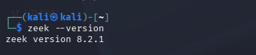
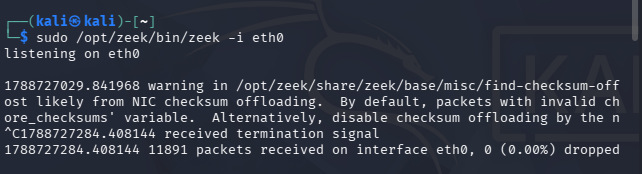
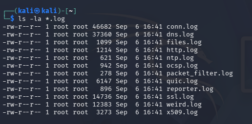
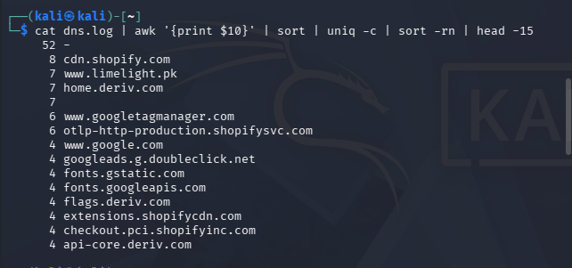
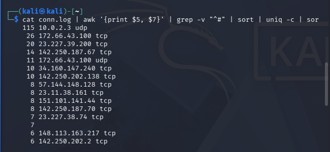
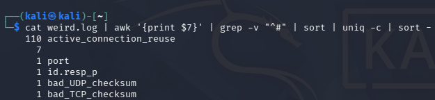
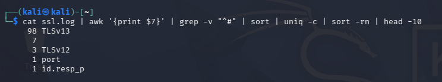

# Network Traffic Analysis with Zeek

## Project Overview
This project involved capturing and analyzing live network traffic using **Zeek** (an open-source network security monitoring tool) in a self-configured **Kali Linux (VirtualBox)** lab environment. The goal was to practice fundamental SOC analyst skills — traffic capture, log analysis, and anomaly triage — following standard blue team methodology.

## Environment
- **OS:** Kali Linux (VirtualBox VM)
- **Tool:** Zeek v8.2.1
- **Interface monitored:** eth0
- **Capture duration:** ~2 minutes of live browsing traffic
- **Packets captured:** 11,891

## Methodology
1. Captured live network traffic while browsing multiple websites (search engine, e-commerce, trading platform).
2. Reviewed Zeek's auto-generated logs (`dns.log`, `conn.log`, `weird.log`, `ssl.log`).
3. Identified top domains, connections, and protocol usage.
4. Flagged unfamiliar IP addresses and verified them via WHOIS lookup.
5. Reviewed Zeek's built-in anomaly detection (`weird.log`) to confirm no malicious activity was present.

## Screenshots

**Zeek version check and interface identification**

**Live traffic capture in progress**

**Generated log files**

**DNS analysis — top queried domains**

**Connection analysis — top IPs and protocols**

**Anomaly detection — weird.log review**

**SSL/TLS version analysis**

*(Note: Replace the image files in the `screenshots/` folder with your own captures using the same filenames, or update the paths above to match your filenames.)*

## Findings

### 1. DNS Analysis (`dns.log`)
Traffic showed standard web browsing patterns, including:
- Search engine queries (Google)
- An e-commerce site built on the Shopify platform (CDN, checkout, and asset domains)
- A trading platform (Deriv)
- Standard third-party services: Google Fonts, Google Tag Manager, ad-tracking (DoubleClick)

**Conclusion:** No malicious or suspicious domains identified.

### 2. Connection Analysis (`conn.log`)
Top destination IPs were cross-referenced against known service providers:

| IP Range | Service |
|---|---|
| 142.250.x.x | Google |
| 23.227.x.x | Shopify |
| 151.101.x.x | Fastly CDN |
| 172.66.x.x | Cloudflare |
| 10.0.2.3 | Local DNS resolver (VirtualBox NAT gateway) |

Two IPs (57.144.148.128 and 148.113.163.217) did not immediately match a recognizable provider and were manually verified via WHOIS as part of standard triage practice.

**Conclusion:** All connections traced back to legitimate, well-known infrastructure providers.

### 3. Anomaly Detection (`weird.log`)
Zeek's built-in anomaly detector flagged the following:

| Anomaly | Count | Assessment |
|---|---|---|
| active_connection_reuse | 110 | Normal browser behavior (HTTP keep-alive) |
| bad_UDP_checksum | 1 | VirtualBox NIC checksum offloading artifact — not a real network issue |
| bad_TCP_checksum | 1 | Same cause as above |

**Conclusion:** No indicators of malware, scanning, or data exfiltration were found.

### 4. Encryption Analysis (`ssl.log`)
- **98 connections** used **TLS 1.3** (current industry-standard encryption)
- **3 connections** used **TLS 1.2** (still considered secure)
- No outdated or vulnerable protocols (e.g. SSLv3, TLS 1.0) were observed

**Conclusion:** All encrypted traffic met current security standards.

## Overall Assessment
The captured traffic represented normal, legitimate web browsing activity. No indicators of compromise (IOCs), malicious domains, suspicious beaconing, or outdated encryption were identified. All findings were cross-verified using WHOIS lookups and Zeek's native anomaly detection.

## What I Learned
- How to capture live traffic using Zeek on a monitored interface
- How to read and interpret Zeek's core log files (dns.log, conn.log, weird.log, ssl.log)
- How to triage unfamiliar IP addresses using WHOIS and threat intelligence tools
- How to distinguish between normal network noise and genuine indicators of compromise
- The importance of using automated tools (e.g. Zeek's weird.log) to prioritize investigation instead of manually reviewing every connection

## Tools Used
- Zeek (Network Security Monitor)
- Kali Linux
- WHOIS (command-line lookup)

---
*Part of a self-directed SOC Analyst skill-building portfolio — Ifsa Tabbasum*
